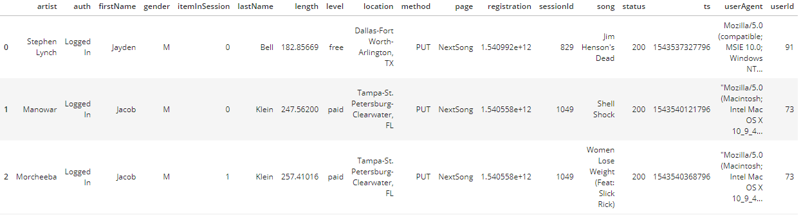

# Modeling Sparkify's User Behaviour

Sparkify is a music streaming application that is interested in analyzing the behaviour of its users and their music preferences.

This repository contains Python scripts for creating tables in Spark and executing an ETL process to load the data into the corresponding tables. The proposed database schema models songs, artists, users, the time and events of when the user is interacting within the app.

## Input data

The following JSON data regarding songs and user activity on the app was given on an AWS bucket and follows this structure:
- **data**
	- **song_data**: which consists of directories of files containing a JSON file with the following structure:
	```
	{
		"num_songs": 1,
		"artist_id": "ARJIE2Y1187B994AB7",
		"artist_latitude": null,
		"artist_longitude": null,
		"artist_location": "",
		"artist_name": "Line Renaud",
		"song_id": "SOUPIRU12A6D4FA1E1",
		"title": "Der Kleine Dompfaff",
		"duration": 152.92036,
		"year": 0
	}
	```
		
	
	- **log_data**: which consists on event simulated data applied to the previous songs dataset (this is based on this project https://github.com/Interana/eventsim).
		
		This is also composed by a list of directories, but this time partitioned by the year and date of the event. For this dataset, we have the following structure:
		
		
## How to run the scripts?

This repository contains the following files explained below:
- **dl.cfg**: Configuration file in which AWS credentials are specified.
- **etl.py**: Python script which loads the data from S3 into the intermediary dataframes, and also inserts data into the final destination tables into S3
- **README.md**: Documentation of this repository.

### Sequence of execution for easy understanding and experimentation:

*Disclaimer: you need to have a EMR cluster running in your AWS account and change the corresponding values in dl.cfg before executing these scripts.*

1. Run the **etl.py** script in order to extract, transform and load the data into the corresponding S3 objects.

## Database Schema Design

The proposed data model consists of the following tables:

- **Fact tables**:
	- songplays (songplay_id, start_time, user_id, level, song_id, artist_id, session_id, location, user_agent)

- **Dimension tables**:
	- users (user_id, first_name, last_name, gender, level)
	- songs (song_id, title, artist_id, year, duration)
	- artists (artist_id, name, location, latitude, longitude)
	- time (start_time, hour, day, week, month, year, weekday)

The reasoning for using fact and dimension tables is that the songplays fact table in combination with the other dimension tables allow us to directly inspect or make aggregations regarding when the events happened, which users performed those actions, from where, which devices they used and what songs they listened to.